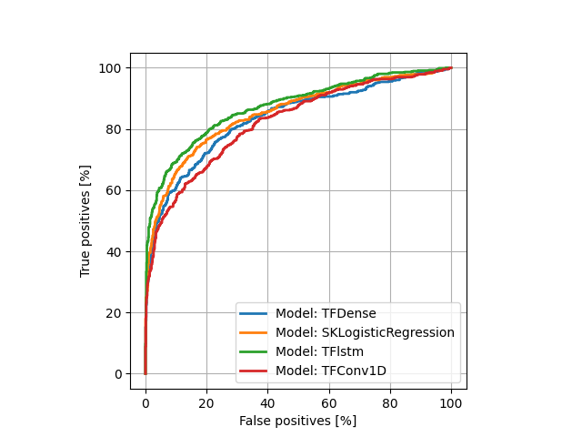

# Natural Language Processing with Disaster Tweets

## Description

This repo is used to practice the developement of ML models for NLP problem and building good habits with ML/AI development in general.

## Getting started

Install the requirements in a virtual environment. I suggest using `pyenv`:

```bash
pyenv virtualenv 3.9.7 nlp-tweets
pyenv local nlp-tweets
pip install -r requirements
pip install -e .
```

## Developments

Fork this repo and configure a remote `dvc` remote storage as explained in [here](https://dvc.org/doc/use-cases/sharing-data-and-model-files#setup-dvc-remote).

GitHub actions are configured in `.github/workflows/cml.yaml` to assess models improvement with respect to the `master` branch. Don't forget to setup the repo actions secrets (in particular `GDRIVE_CREDENTIALS_DATA`).

### Preprocessors

A new data preprocessor can be implemented as follows:

- Define a class inheriting from `Preprocessor` in `src/preprocessors/<new_model.py>`
- Register the new preprocessor in the factory located in `src/preprocessors/__init__.py`
- Add the preprocessor information in `dvc.yaml` (in particular the `prepare_data` stage)

### Models

A new model can be implemented as follows:

- Define a class inheriting from `Model` or `TFModel` in `src/models/<new_model.py>`
- Register the new model in the factory located in `src/models/__init__.py`
- Add the model information (preprocessor, output name) in `dvc.yaml`

## Latest results

### ROC curves on test data



### Scores on test data

F1 scores obtained with `threshold = 0.5`:

| Path                                           | f1_score   |
|------------------------------------------------|------------|
| models/TFlstm/test_metrics.json                | 0.76274    |
| models/SKLogisticRegression/test_metrics.json  | 0.74551    |
| models/TFDense/test_metrics.json               | 0.71746    |
| models/TFConv1D/test_metrics.json              | 0.70093    |

